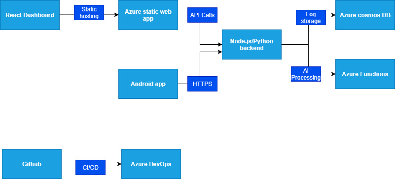

_I plan to use some of the skills learned from the EarTech IT internship to build my dream project_ 
# SIEM + AI Cybersecurity Dashboard  
_A cost-effective Security Information and Event Management (SIEM) system with real-time threat detection, built with React, Node.js, and Azure._

# System Diagram


## Features
- **Real-time Log Monitoring**: Ingest and analyze system/auth logs.  
- **AI Threat Detection**: Anomaly detection using Python ML models.  
- **Cross-Platform**: Web dashboard (React) + Mobile app (Android).  
- **Secure**: JWT authentication, HTTPS, and rate limiting.  

## Tech Stack  
| **Component**       | **Technology**                  |  
|---------------------|---------------------------------|  
| **Frontend**        | React.js, Tailwind CSS          |  
| **Backend**         | Node.js (Express)               |  
| **Database**        | Azure Cosmos DB (NoSQL)         |  
| **AI Engine**       | Python (Scikit-learn, TensorFlow)|  
| **Hosting**         | Azure Static Web Apps, App Service |  
| **CI/CD**           | GitHub Actions, Azure DevOps    |  

## Setup (Local Development)
- Frontend(React)
```bash
    cd web-app/client
    npm create vite@latest . -- --template react # This should allow you to install dependencies when it is done if not, type `npm install on the terminal`
```
    - Also i went for "React router v7"

## Note
- The README.md will be continuously being updated.

